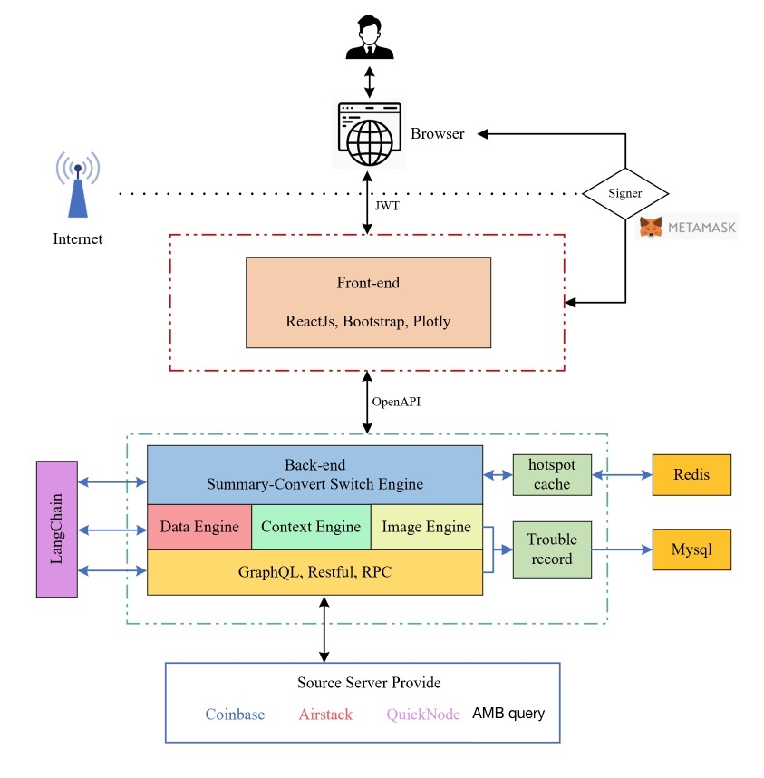

# 2023WXH-ChatData

## 基本资料

项目名称：ChatData Insight - A tool to analyze blockchain data through chat, using LLM.

website: http://chatdatainsight.com/

## 项目整体简介
### Background

In the rapidly evolving blockchain industry, data is being generated at an unprecedented rate. This data, which includes transaction volumes, token prices, and market trends, holds immense value for various stakeholders, including investors, analysts, and developers. However, the sheer volume and complexity of blockchain data have made it difficult for individuals to access and analyze this information effectively. Traditional data analysis tools are often not tailored to the specific needs of blockchain data and require extensive technical knowledge, which creates a barrier for many users.

ChatDataInsight aims to bridge this gap by introducing a pioneering web3 data analysis project. By leveraging the advanced capabilities of artificial intelligence and conversational chat models, especially GPT, ChatDataInsight is poised to revolutionize the way users access and analyze blockchain data.

### Project Description
ChatDataInsight is designed to be a user-centric platform that democratizes data analysis in the blockchain industry. It allows users to submit queries in natural language through an interactive webpage. The platform's AI-powered engine then processes these queries, connects to multiple databases and service interfaces, and aggregates relevant data. The data is analyzed, and the insights are presented to the users in a variety of formats, including text, tables, and charts.

The platform also features a freemium model, allowing users to access basic features for free. Additionally, it offers a subscription-based membership service with premium features such as faster response times and access to advanced models. Users can pay for membership services through conventional methods as well as blockchain methods.

What sets ChatDataInsight apart is its continuous learning mechanism. The system learns from unanswered or poorly answered questions and improves the quality and accuracy of responses over time. Furthermore, it has the potential for cross-chain data analysis, enabling users to analyze data across multiple blockchain datasets such as Ethereum, BSC, Polkadot, Near, and Solana.

ChatData Insight is a tool to analyze blockchain data through chat, like chatGPT for web3:
1. Seamless user interaction through natural language processing.
2. Highly intelligent data analysis based on generative artificial intelligence.
3. Provide intelligent recommendations based on user preferences and behaviors.
4. Customized dashboards and insight sharing.

### Technology Architecture

### Logo
